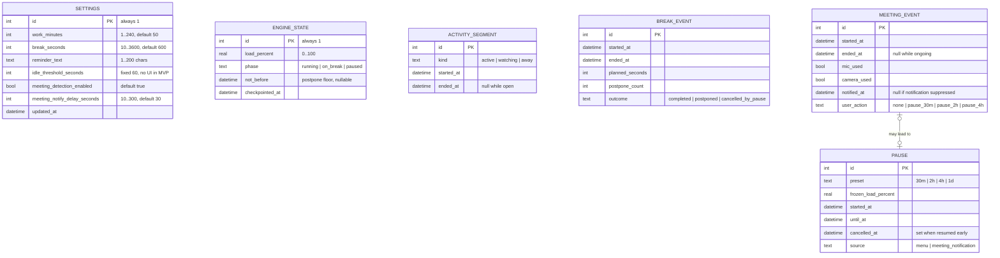
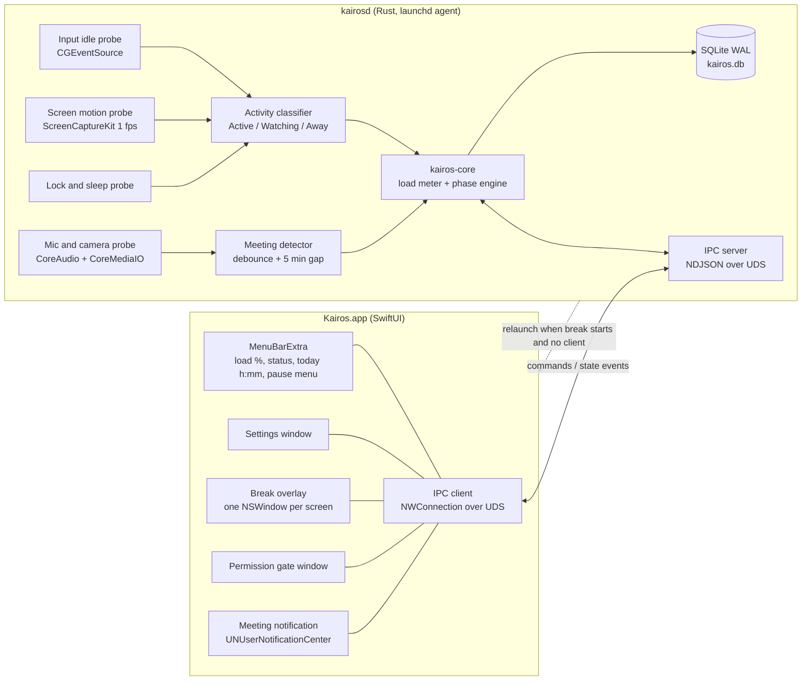
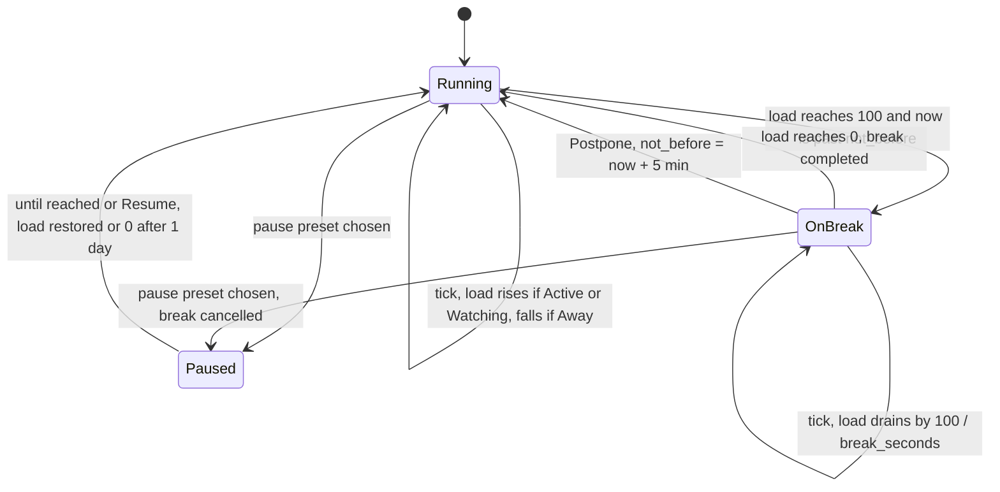
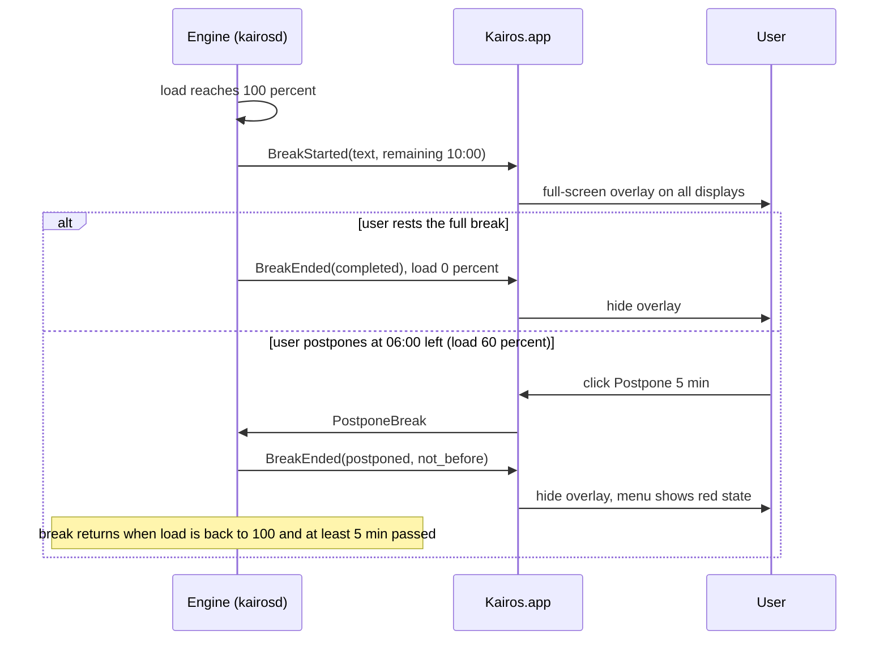
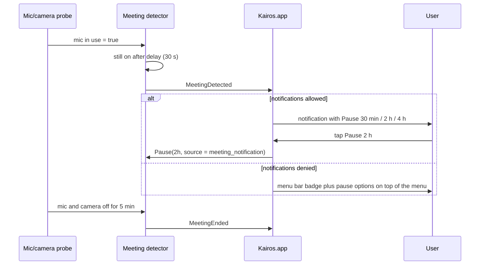

# Kairos — Break Reminder MVP (Rust daemon + SwiftUI menu bar app)

Status: implemented — manual verification pending (see SPIKE.md, PERF.md, Manual QA)

## Functional Requirement

### Decisions
- **Architecture:** a Rust background daemon (`kairosd`, launchd LaunchAgent) owns all timing, activity detection, meeting detection and persistence. A SwiftUI menu bar app (`Kairos.app`) is the UI client and talks to the daemon over a Unix domain socket (IPC).
- **Platform:** macOS 14+ (Sonoma), Apple Silicon and Intel. Not sandboxed. Signed with a free **Apple Development** certificate so the Screen Recording grant survives rebuilds. No notarization.
- **App shell:** menu bar only (`MenuBarExtra`, `LSUIElement`, no Dock icon) plus a Settings window.
- **Load meter:** a single percentage (0–100 %) is both the timer and the user-facing number.
  - It rises at `100 % / work_minutes` while the user is **Active** or **Watching**.
  - It falls at `100 % / break_duration` while the user is **Away**.
  - At 100 % the break starts. During the break it drains to 0 %.
- **Video detection:** ScreenCaptureKit samples all displays continuously at 1 fps whenever Kairos isn't paused, so the purple recording indicator stays on steadily. Screen Recording permission is **mandatory**.
- **Break overlay:** full-screen on every display, with a single **Postpone 5 min** button. There is no Skip button and no CLI escape. To skip longer, the user postpones and then pauses from the menu.
- **Meeting detection:** the mic or camera in use by **any** app counts as a meeting. The user gets one notification per meeting offering to pause. Screen-share detection is out of scope.

### MVP
The user has the ability to:
1. **Configure the schedule:** work duration in minutes (1–240, default **50**) and break duration in minutes **and** seconds (0:10–60:00, default **10:00**).
2. **Customize the reminder text** shown on the break overlay (1–200 chars, default "Time to rest your eyes. Stand up and stretch.").
3. **Have screen time measured automatically.** Every 1 s the user is classified as:
   - **Active**: keyboard, mouse or trackpad input within the last **60 s** (fixed in the MVP; stored so it can be made configurable later).
   - **Watching**: no input for 60 s, but screen content is changing on any display (video, call, animation).
   - **Away**: anything else, plus a locked screen and system sleep.
4. **See the load meter** as `NN%` in the menu bar.
   - It rises while Active or Watching and falls while Away. A full break-length absence always brings it to 0 %.
   - While a break is postponed, it shows **100 % in red** and does not exceed 100 %.
   - While paused, it shows `⏸ NN%`, frozen.
5. **Get a full-screen break overlay** on every display when the meter reaches 100 %.
   - It shows the reminder text and a `mm:ss` countdown, which is the time left for the meter to drain to 0 %.
   - It closes automatically at 0 %.
6. **Postpone a break** with the only overlay button, **Postpone 5 min**. The overlay closes and the break comes back when the meter is ≥ 100 % again, but **never sooner than 5 minutes** after the click. Rest already taken counts, so postponing at 40 % brings the break back once the meter climbs back to 100 %.
7. **Pause Kairos** from the menu for **30 minutes, 2 hours, 4 hours or 1 day (24 h from the click)**, and **Resume** early at any time.
   - While paused there is no counting, no recording, no screen sampling, no meeting notifications and no breaks.
   - Pausing cancels a pending or postponed break.
   - When the pause ends, the meter continues from its frozen value for 30 min / 2 h / 4 h pauses. After a 1-day pause it restarts at 0 %.
8. **See today's status in the dropdown:**
   - "Break in mm:ss" (or "Break postponed · m:ss", or "Paused until HH:MM")
   - the current activity (Active / Watching / Away / Paused)
   - **today's worked time** as `h:mm` (Active + Watching since local midnight)
9. **Be offered a pause when a meeting starts.** When any app keeps the mic or camera on for the configured delay (default 30 s), Kairos sends **one** notification with **Pause 30 min / 2 h / 4 h** actions.
   - A new meeting starts only after the mic and camera have been off for 5 minutes.
   - Ignoring the notification changes nothing: breaks still happen.
   - If notification permission is denied, the menu bar icon shows a 🎙 badge and the pause options move to the top of the dropdown for the duration of the meeting.
10. **Configure meeting detection** in Settings: an on/off toggle (default on) and "Notify after mic/camera is on for" (10 s – 5 min, default 30 s).
11. **Grant Screen Recording.**
    - If the permission isn't granted at launch, or is revoked later, a blocking window explains why and offers **Open System Settings** and **Quit**.
    - After the user grants it, the window offers **Restart Kairos**.
    - There is no input-only mode.
12. **Change settings mid-cycle without surprises.** Saving keeps the current percentage and only changes the rise and fall rates, so a save never triggers a break immediately.
13. **Start Kairos at login.** The daemon and app are registered via `SMAppService`, and **Quit** stops both until the next login or launch.

### Out of scope (post-MVP)
- Screen-share detection (macOS has no public API; window-title heuristics are fragile).
- A configurable input-idle threshold (stored as a constant in Settings, no UI yet).
- A configurable "5 minutes off = new meeting" gap.
- A separate Active / Watching breakdown of today's time, history dashboard, charts, reports, CSV export.
- Power-assertion-based video detection, and an app allowlist/denylist for motion or meeting detection.
- Skip-break button, strict mode, `kairosctl` CLI escape, limits on consecutive postpones.
- Multiple schedules or profiles, a long break every N cycles, the 20-20-20 eye rule.
- Calendar or Focus-mode integration, auto-pausing during meetings without user action.
- Camera-based presence detection.
- Sounds, a "break in 1 min" pre-warning, break activity suggestions.
- Localization, theming, overlay backgrounds.
- iCloud sync, multi-device, Windows/Linux.
- Notarized DMG, auto-update (Sparkle), App Store or sandboxing.

## Non-functional Requirement

**CAP / consistency model (single machine, two processes)**
- The daemon is the **single source of truth** for the meter, phase, settings and history. The app renders the state the daemon pushes and sends commands. It never computes timer logic itself.
- **Partition = IPC disconnect**, e.g. the app crashed.
  - The daemon favours **availability of tracking**: it keeps counting and persisting.
  - The app shows "Disconnected" and reconnects with backoff (0.5 s → 5 s).
  - On reconnect it gets a full snapshot, so the UI converges within 1 s.
- If a break starts with 0 connected clients, the daemon relaunches `Kairos.app` (`open -b`). The overlay then shows the *remaining* break time.
- **Quit** sends `Shutdown`. The daemon exits with code 0, and launchd (`KeepAlive.SuccessfulExit=false`) does not restart it. A crash (non-zero exit) is restarted.
- Persistence uses SQLite in WAL mode.
  - The engine state (meter, phase, `not_before`) and open activity segments are checkpointed every **10 s**, so a crash loses ≤ 10 s.
  - Settings, pause and postpone changes are written before the IPC reply.

**Low latency**
- The classification and meter tick runs every 1 s. The overlay is visible **≤ 1 s** after the meter reaches 100 %.
- IPC request → reply p99 is **< 10 ms**. The state push happens every 1 s while a client is subscribed.
- Postpone click → overlay dismissed in **< 200 ms**.
- Meeting notification is delivered **≤ delay + 3 s** after the mic or camera turns on.

**Resource usage**
- Daemon: CPU **< 2 %** average with continuous sampling (1 fps, ≤ 320 px wide frames), **< 50 MB** RSS.
- App: **< 80 MB** RSS, ~0 % CPU when the menu is closed.
- Sampling stops completely while paused.

**Scalability / data growth**
- Single user, single machine. Expect ~500 segment rows a day (~180k a year).
- With an index on `activity_segment(started_at)`, the today-total query stays **< 5 ms** for years. No retention job is needed in the MVP.

**Privacy & security**
- Frames are processed in memory only. They are never written to disk, logged, or sent anywhere. No network access at all.
- Mic and camera state is read as an on/off flag only. No audio or video is captured.
- The IPC socket is `~/Library/Application Support/Kairos/kairosd.sock`, mode `0600`, and peers with a different UID are rejected (`getpeereid`).

**Reliability**
- A tick gap > 5 s (sleep, wake, clock jump) is recorded as **Away**, and the meter decays for that span.
- Screen lock counts as Away.

## Core Models

- The active pause is the row with `until_at > now AND cancelled_at IS NULL`. On resume, the meter is set to `frozen_load_percent`, or to 0 when `preset = 1d`.
- Today's worked time = the sum of `active` + `watching` segment durations, clipped to `[local 00:00, now)`.

### Meter math (per 1 s tick)
| Phase / activity | Δ load per second | Notes |
|---|---|---|
| running, Active or Watching | `+100 / (work_minutes × 60)` | capped at 100 |
| running, Away | `−100 / break_seconds` | floored at 0 |
| on_break (any activity) | `−100 / break_seconds` | at 0 → break completed → running |
| paused | 0 | frozen |

- **Break trigger:** `phase = running AND load ≥ 100 AND (not_before IS NULL OR now ≥ not_before)`.
- **Postpone:** `phase → running`, `not_before = now + 5 min`, `postpone_count += 1`.
- **Countdown shown on the overlay:** `load / 100 × break_seconds`.
- **"Break in" shown in the dropdown:** `max((100 − load) / rise_rate, not_before − now)`.

## High-level diagram

### Components

### Engine phases

### Break and postpone flow

### Meeting nudge flow

### Activity classification (per 1 s tick)
| Condition | Result |
|---|---|
| Paused | nothing classified or recorded |
| Screen locked, or tick gap > 5 s | `Away` |
| Input idle < 60 s | `Active` |
| Input idle ≥ 60 s **and** motion detected | `Watching` |
| otherwise | `Away` |

**Motion detected** means that in ≥ 4 of the last 5 one-second samples, ≥ 3 % of the downscaled frame area changed on any display. The changed area comes from ScreenCaptureKit dirty rects, with a 32×18 tile luminance diff as the fallback. Kairos's own windows are excluded from capture.

## Tasks (For AI Agents to read)

### Phase 0 — Spikes & scaffolding
- [~] **Spike A (TCC):** *(frames verified; agent attribution + rebuild survival pending — see SPIKE.md)* a minimal Rust binary using the `screencapturekit` crate, registered via `SMAppService.agent` from a host app signed with the Apple Development certificate. Confirm three things:
  - the Screen Recording grant applies to the agent,
  - frames arrive,
  - the grant survives a rebuild.

  **Fallback if any check fails:** move the screen motion probe into Kairos.app and stream `MotionSample{changed_ratio}` to the daemon. The classifier interface stays unchanged. Record the result in `docs/kairos-mvp/SPIKE.md`.
- [~] **Spike B (mic/camera):** *(reads and no-prompt verified; per-app trials pending — see SPIKE.md)* from the same agent, read `kAudioDevicePropertyDeviceIsRunningSomewhere` on every input device and `kCMIODevicePropertyDeviceIsRunningSomewhere` on every camera. Test with Zoom or Meet in a browser, FaceTime, Continuity Camera and the OBS virtual camera, and confirm there's **no TCC prompt**. Record the listener vs. polling behaviour in `SPIKE.md`.
- [x] Create a Cargo workspace with `crates/kairos-core`, `crates/kairos-ipc`, `crates/kairos-store`, `crates/kairos-platform-macos` and `crates/kairosd`. Verify that `cargo build --workspace` passes.
- [x] Create the XcodeGen `apps/macos/project.yml` for `Kairos`: a SwiftUI app with `LSUIElement=YES`, a macOS 14 target, a test target and the Apple Development signing team as a build setting. Verify that `xcodebuild -scheme Kairos build` passes. *(Project generates; `xcodebuild` needs full Xcode, so this is verified in CI. Locally the same sources build with `swift build`.)*
- [x] Write `scripts/build.sh`:
  - build a universal `kairosd` (arm64 + x86_64 via `lipo`)
  - copy it into `Kairos.app/Contents/MacOS/`
  - install `Contents/Library/LaunchAgents/com.kairos.daemon.plist` (`KeepAlive.SuccessfulExit=false`)
  - codesign the bundle
- [x] Set up CI on GitHub Actions (macos-14) running `cargo fmt --check`, `cargo clippy -D warnings`, `cargo test --workspace` and `xcodebuild test`.

### Phase 1 — Core logic (pure Rust, injectable clock)
- [x] `kairos-core`: `Settings` with the validation ranges and defaults above, plus `ActivityKind`, `Phase { Running, OnBreak, Paused }` and `PausePreset { M30, H2, H4, D1 }`.
- [x] `kairos-core`: `Engine::tick(now, ActivityKind) -> Vec<EngineEvent>` implementing the meter math table, the break trigger, postpone with `not_before`, the 100 % cap, the 0 % floor and tick-gap decay.
- [x] `kairos-core`: `Engine::pause(preset)` and `resume()`, implementing frozen load, the reset to 0 after 1 day, and cancelling a pending or postponed break.
- [x] `kairos-core`: `Engine::apply_settings(new)`, which keeps `load_percent` and changes only the rates.
- [x] `kairos-core`: `MotionDetector` (5-sample ring buffer, 4-of-5 rule, 3 % threshold) and `Classifier::classify(...)` per the classification table.
- [x] `kairos-core`: `MeetingDetector`, which turns mic and camera flags into `MeetingStarted` after a configurable delay and `MeetingEnded` after 5 minutes off, with one notification per meeting and none while paused or disabled.
- [x] Unit tests for every spec in `Specs § Meter`, `§ Break`, `§ Pause`, `§ Activity` and `§ Meeting`, using a fake clock. Verify with `cargo test -p kairos-core`.

### Phase 2 — Persistence
- [x] `kairos-store`: SQLite (`rusqlite` with `bundled`) at `~/Library/Application Support/Kairos/kairos.db` in WAL mode, with versioned migrations creating the 6 tables in Core Models and an index on `activity_segment(started_at)`.
- [x] Repositories: settings, engine-state checkpoint and restore, segment open/close/checkpoint, break events, pauses, meeting events, and `today_worked_seconds(tz)`.
- [x] On startup:
  - restore `ENGINE_STATE`
  - close dangling segments at `checkpointed_at`
  - apply decay for the downtime gap (count it as Away)
  - expire past pauses
- [x] Tests with an in-memory DB, including a segment that spans midnight and a restore after a simulated 30-minute downtime.

### Phase 3 — macOS probes (Rust)
- [x] `input_idle_seconds()` via `CGEventSourceSecondsSinceLastEventType`.
- [x] `is_screen_locked()` via `CGSessionCopyCurrentDictionary["CGSSessionScreenIsLocked"]`.
- [x] `ScreenMotionProbe`:
  - a continuous SCStream over all displays at ≤ 320 px wide and 1 fps, excluding Kairos windows
  - emits `changed_ratio` per frame (dirty rects first, tile-diff fallback)
  - restarts when displays change
  - stopped while paused
  - never persists frames
- [x] `screen_recording_permission()` via `CGPreflightScreenCaptureAccess`, re-checked every 30 s so revocation is detected.
- [x] `AvProbe`: mic in use (CoreAudio, listener plus 2 s poll fallback) and camera in use (CoreMediaIO, 2 s poll), returning `{mic: bool, camera: bool}`.
- [x] `scripts/probe-demo.sh`, which prints idle seconds, lock state, changed_ratio, mic and camera every second for 60 s.

### Phase 4 — Daemon & IPC
- [x] `kairos-ipc`: NDJSON protocol with a `v: 1` field.
  - **Requests:** `GetState`, `Subscribe`, `UpdateSettings`, `Pause{preset, source}`, `Resume`, `PostponeBreak`, `Shutdown`.
  - **Events:** `State{phase, activity, load_percent, break_in_s, break_remaining_s, postponed, paused_until, today_worked_s, permission, meeting_active}`, `BreakStarted{text, remaining_s}`, `BreakEnded{reason}`, `MeetingDetected`, `MeetingEnded`.
- [x] Shared fixtures in `protocol/fixtures/*.json`, tested for round-trip in Rust (serde) and Swift (Codable).
- [x] `kairosd`:
  - a tokio runtime with a 1 s tick: probes → classifier → engine → store (checkpoint every 10 s)
  - a UDS server (0600, UID check) broadcasting `State` every 1 s
  - `Shutdown` → clean exit 0
- [x] `kairosd`: relaunch the app via `open -b` when `BreakStarted` or `MeetingDetected` fires with 0 subscribers.
- [x] Integration test: spawn the daemon with a temp DB, socket and fake probes, then drive a full cycle (rise → break → postpone → break → complete → pause → resume → meeting nudge) and assert the event stream.

### Phase 5 — SwiftUI app
- [x] `IPCClient` (Network.framework `NWConnection` to `.unix(path:)`): NDJSON framing, Codable models, reconnect with backoff, and an `@Observable DaemonStore`.
- [x] `MenuBarExtra` label: `NN%` with a ring icon. Red at 100 % while postponed, `⏸ NN%` while paused, 🎙 badge during a meeting when notifications are denied.
- [x] Dropdown, in order:
  - meeting pause options (when the badge is shown)
  - "Break in mm:ss" / "Break postponed · m:ss" / "Paused until HH:MM"
  - activity
  - `Today h:mm`
  - "Pause for…" (30 min / 2 hours / 4 hours / 1 day)
  - Resume
  - Settings…
  - Quit (sends `Shutdown`, then terminates)
- [x] Settings window:
  - work-minutes stepper (1–240)
  - break minute + second pickers (0:10–60:00)
  - reminder text (200-char counter)
  - meeting detection toggle and delay slider (10 s – 5 min)
  - launch-at-login toggle
  - inline validation errors from the daemon
- [x] `BreakOverlayController`:
  - one borderless `NSWindow` per `NSScreen`, level `.screenSaver`, `collectionBehavior = [.canJoinAllSpaces, .fullScreenAuxiliary]`
  - shows the text, the `mm:ss` countdown and a single **Postpone 5 min** button
  - Esc and Cmd+W are ignored
  - reacts to screens being attached or detached
- [x] `PermissionGateWindow`:
  - shown when `permission != granted`, with **Open System Settings** (deep link to Privacy & Security → Screen Recording) and **Quit**
  - once granted, shows **Restart Kairos** (relaunches the app and asks the daemon to restart its capture)
- [x] `MeetingNotifier`: `UNUserNotificationCenter` category with three actions (Pause 30 min / 2 h / 4 h) that send `Pause{source: meeting_notification}`. Notification permission is requested on first launch, and the badge fallback is used when it's denied.
- [x] First launch: register `SMAppService.agent(plistName:)` and `SMAppService.mainApp`, then run the permission gate and the notification permission prompt.
- [x] XCTest: Codable fixtures, `DaemonStore` reducers, label formatting (`NN%`, red, ⏸) and countdown formatting.

### Phase 6 — Hardening & release check
- [~] 10-minute CPU and RSS measurements *(smoke numbers recorded; 3×10 min runs pending, `scripts/perf-sample.sh`)* in three modes (typing, idle with video playing, idle with a static screen), recorded in `docs/kairos-mvp/PERF.md`. They must meet the NFR budgets.
- [ ] Run the manual QA checklist in `Specs § Manual QA`.
- [x] `README.md`: build, signing setup (Apple Development team ID), permissions and architecture summary.

## Specs

Defaults for all cases unless stated otherwise: work 50 min, break 10:00. That's +2 %/min while Active or Watching and −10 %/min while Away.

### Meter
| # | Given | When | Then |
|---|---|---|---|
| M1 | load 0 %, user Active | 25 min pass | menu bar shows `50%` and dropdown shows "Break in 25:00" |
| M2 | load 50 % | user Away for 3 min | load is 20 % |
| M3 | load 30 % | user Away for 10 min | load is 0 % (floor), not negative |
| M4 | load 60 %, no input, video playing full-screen | 5 min pass | classified Watching, load is 70 % |
| M5 | load 60 % | Mac sleeps 2 h, then wakes | load is 0 %, and the 2 h are not counted in today's total |
| M6 | load 50 %, work 50 min | user changes work to 25 min and saves | load stays 50 %, now rises 4 %/min, and no break fires on save |
| M7 | Settings form | work = 0 or break = 0:05 entered | save rejected with an inline error, stored settings unchanged |

### Break
| # | Given | When | Then |
|---|---|---|---|
| B1 | load 99.97 %, Active | next tick reaches 100 % | overlay on all displays within 1 s, showing the custom text and `10:00` |
| B2 | on break | 10 min pass | load is 0 %, overlay closes, `BREAK_EVENT.outcome = completed` |
| B3 | on break at 10:00 left (load 100 %) | user clicks Postpone | overlay closes < 200 ms, menu bar shows red `100%`, dropdown shows "Break postponed · 5:00" |
| B4 | postponed at load 100 %, user Active | 5 min pass | overlay reappears with `10:00`, `postpone_count = 1` |
| B5 | on break at 04:00 left (load 40 %) | user clicks Postpone and stays Active | overlay returns after 30 min (40 % → 100 %), not after 5 min |
| B6 | postponed | user clicks Postpone repeatedly on each return | allowed every time, with no limit |
| B7 | reminder text "Drink water 💧" | break starts | overlay shows exactly "Drink water 💧" |
| B8 | on break | user presses Esc / Cmd+W / Cmd+Tab | overlay stays visible |
| B9 | on break, external monitor plugged in | — | overlay also appears on the new display |

### Pause
| # | Given | When | Then |
|---|---|---|---|
| P1 | load 80 % | user picks Pause 30 min | menu shows `⏸ 80%` and "Paused until HH:MM", with no sampling (purple indicator gone) |
| P2 | presets 2 h / 4 h / 1 day | each one picked | `until_at` = now + 2 h / 4 h / 24 h |
| P3 | paused 2 h at 80 % | pause ends | load resumes at 80 % |
| P4 | paused 1 day at 80 % | pause ends | load resumes at 0 % |
| P5 | paused | user clicks Resume | counting resumes immediately and `cancelled_at` is set |
| P6 | postponed break pending | user pauses | break cancelled, `outcome = cancelled_by_pause` |
| P7 | paused 4 h | daemon killed and restarted | still paused with the same `until_at` and frozen load |
| P8 | paused, mic in use | 1 min passes | no meeting notification |

### Activity
| # | Given | When | Then |
|---|---|---|---|
| A1 | running | user types / moves the trackpad | Active |
| A2 | no input ≥ 60 s, YouTube playing on the **second** display | 5 s of samples | Watching |
| A3 | no input ≥ 60 s, static screen | tick | Away |
| A4 | screen locked (⌃⌘Q), video still playing | tick | Away |
| A5 | sampling running | 1 h of use | no image files created anywhere (`fs_usage` shows no frame writes) |

### Meeting
| # | Given | When | Then |
|---|---|---|---|
| G1 | detection on, delay 30 s | Zoom turns on the mic for 30 s | one notification with Pause 30 min / 2 h / 4 h |
| G2 | notification shown | user taps "Pause 2 h" | paused until now + 2 h, `PAUSE.source = meeting_notification` |
| G3 | meeting ongoing | mic toggles off for 2 min, then on again | no second notification |
| G4 | meeting ended (mic and camera off ≥ 5 min) | camera turns on for 30 s | a new notification is sent |
| G5 | delay set to 2 min | mic on for 90 s, then off | no notification |
| G6 | notification permission denied | meeting detected | 🎙 badge on the menu bar and pause options at the top of the dropdown, both cleared when the meeting ends |
| G7 | detection toggled off | mic on for 10 min | no notification and no badge |
| G8 | notification ignored | load reaches 100 % mid-meeting | break overlay still appears |

### Permission, IPC & resilience
| # | Given | When | Then |
|---|---|---|---|
| R1 | Screen Recording not granted | app launches | blocking window with Open System Settings and Quit, and no tracking |
| R2 | permission window open | user grants permission in System Settings | window switches to Restart Kairos, and after restart tracking starts |
| R3 | running | user revokes Screen Recording | within 30 s the permission window appears again |
| R4 | running | user clicks Quit | app and daemon both exit, and launchd does not restart the daemon |
| R5 | app force-quit at load 40 % | 10 min Active, then app reopened | menu shows `60%` (the daemon kept counting) |
| R6 | app not running (crashed) | break becomes due | daemon relaunches the app and the overlay shows the remaining time |
| R7 | daemon `kill -9` | launchd restarts it | ≤ 10 s of history lost, and the app reconnects within 5 s |
| R8 | segment 23:50 → 00:20 | today's total queried after midnight | only 20 min counted |
| R9 | another local user | connects to the socket | refused |

### Manual QA
- [ ] Overlay covers every display, including a full-screen app on another Space.
- [ ] No Dock icon, menu bar only.
- [ ] Launch at login: both the daemon and the app return after a reboot.
- [ ] The purple screen-recording indicator is steady while running and gone while paused.
- [ ] Meet in Chrome, FaceTime and Slack huddle each trigger exactly one meeting notification.
- [ ] Rebuilding the app does not ask for Screen Recording again (stable signing).

## Key Results
- 100 % of the M*, B*, P*, A*, G* and R* specs pass (automated in `kairos-core` / integration tests where possible, the rest via manual QA).
- Break overlay appears ≤ 1 s after the meter reaches 100 % (from daemon logs, 20 cycles).
- Meter accuracy: after a scripted 25 min Active + 1 min Away, load = 40 % ± 0.5 %.
- Watching detection: ≥ 95 % of 1-minute windows classified Watching during 30 min of full-screen video with no input, and ≤ 5 % during 30 min of an idle static desktop.
- Meeting nudge: delivered within delay + 3 s in ≥ 9 of 10 trials across Zoom, Meet (browser) and FaceTime, with zero duplicate notifications per meeting.
- Daemon < 2 % CPU average and < 50 MB RSS with continuous sampling (recorded in `PERF.md`).
- Zero frames written to disk (`fs_usage` on `kairosd` during a 1 h session).
- Today's worked time within ± 1 min of the actual Active + Watching time over a scripted 2 h run.
- Pause state and frozen load survive a daemon restart, and the pause ends at `until_at` ± 1 s.
